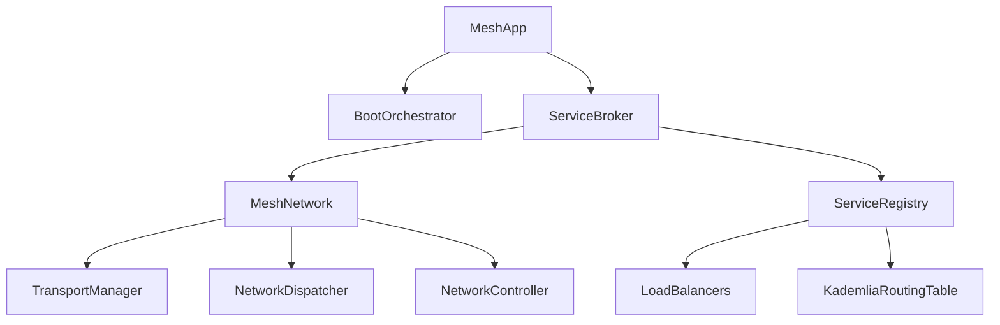
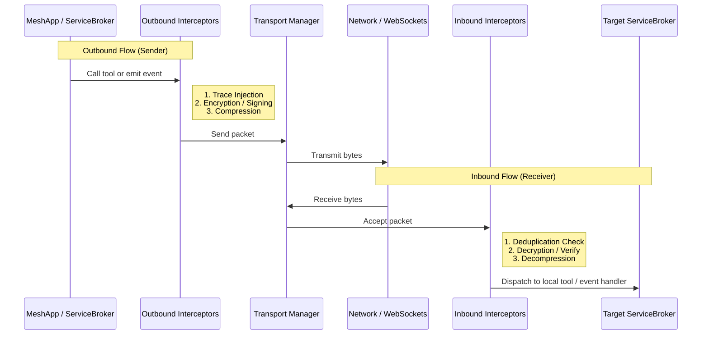

# Mesh Architecture Specification

## Overview
Mesh is a high-performance, isomorphic service mesh library designed for building resilient, distributed systems that run seamlessly in both Node.js and Browser environments. It treats the network as a transparent message bus, handling service discovery, RPC, and event propagation automatically.

By designing the mesh around isomorphic primitives, a single codebase can run server-side orchestration and P2P browser nodes using the same RPC contracts, Event definitions, and CRUD schemas.

---

## Core Philosophy

1. **Isomorphic First**: Every core component must run identically in browser environments (via WebWorkers/WebSockets) and server environments (via TCP/WebSockets/NATS).
2. **Bipartite Pipeline**: Decoupled middleware execution pipelines. Inbound pipelines process messages entering the node, while outbound pipelines process outgoing traffic, enabling custom trace propagation, compression, and security checking.
3. **Decentralized Topology**: The network is self-healing. While bootstrap nodes are used to seed the cluster, nodes construct a logical peer-to-peer overlay using a Kademlia-inspired DHT routing table.
4. **Resilient by Design**: Standard distributed patterns—such as circuit breakers, client-side rate limiters, retries, and request-response timeouts—are implemented as native interceptors.

---

## Component Hierarchy



### Component Breakdown

* **`MeshApp`**: The physical containment shell and Dependency Injection (DI) registry. It binds all providers and schedules module lifecycles.
* **`BootOrchestrator`**: Performs depth-first search (DFS) cycles across module dependency trees to guarantee circular-dependency-free startup sequences.
* **`ServiceBroker`**: The internal request router. It acts as the local API entry point. It evaluates whether a requested action is hosted on the local node or must be bridged onto the `MeshNetwork` for remote execution.
* **`MeshNetwork`**: Orchestrates packet lifecycle phases (deduplication, loopback suppression, namespace checking), executing inbound/outbound interceptors, and coordinating with `TransportManager`.
* **`TransportManager`**: Manages underlying active connections, abstracting differences between TCP sockets, WebSockets, or browser simulated channels under a unified `ITransport` interface.
* **`ServiceRegistry`**: The cluster ledger. It processes heartbeats, evaluates health calculations, manages routing tables (including DHT), and matches action requests to appropriate node endpoints.

---

## Bipartite Pipeline Architecture

The execution of any request or event is split into two distinct, symmetric pipelines:



---

## Code Example: Standard Bootstrap

The following example demonstrates how to bootstrap a Mesh node using the core components:

```typescript
import { MeshApp } from '../core/MeshApp.js';
import { ServiceBroker } from '../core/ServiceBroker.js';
import { Registry } from '../core/Registry.js';
import { MeshNetwork } from '../core/MeshNetwork.js';
import { WebSocketTransport } from '../transports/WebSocketTransport.js';
import { Logger } from '../utils/Logger.js';

async function bootstrap() {
    const logger = new Logger();
    const nodeID = `node-srv-${Math.random().toString(36).substr(2, 9)}`;

    // 1. Initialize the central MeshApp motherboard
    const app = new MeshApp({
        nodeID,
        namespace: 'production',
        logger
    });

    // 2. Instantiate and mount dependencies
    const registry = new Registry(logger, {
        localNodeID: nodeID,
        preferLocal: true,
        dhtEnabled: true,
        ttl: 30000
    });

    const network = new MeshNetwork({
        nodeId: nodeID,
        namespace: 'production',
        bootstrapNodes: ['ws://127.0.0.1:8000'],
        transports: [new WebSocketTransport()],
        port: 8001
    }, logger, registry);

    const broker = new ServiceBroker(nodeID, logger);

    // Bind dependencies into the Service Broker
    broker.setNetwork(network);
    broker.setRegistry(registry);

    // 3. Register providers into the DI container
    app.registerProvider('registry', registry);
    app.registerProvider('broker', broker);
    app.registerProvider('network', network);

    // 4. Start the Application Lifecycle
    await app.start();

    logger.info(`Node ${nodeID} successfully joined the mesh!`);

    // Graceful teardown on exit
    process.on('SIGTERM', async () => {
        logger.info('Shutting down...');
        await app.stop();
        process.exit(0);
    });
}
```
