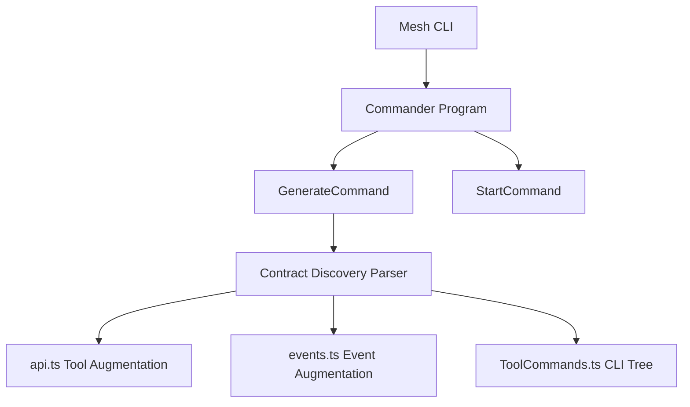

# CLI & Code Generation Specification

## Overview
The Mesh Engine provides high-level coordination and tooling for developers. This is driven by the Mesh CLI for contract-driven code generation, type-safe API augmentations, dynamic command binding, and isomorphic production bundling.

Mesh advocates a **Contract-First** approach to API development. By declaring API endpoints in declarative TypeScript contract files, developers receive fully-typed Client APIs, Event propagation channels, and dynamic CLI commands automatically.

---

## Mesh CLI Architecture

The Mesh CLI uses a command registration structure based on `BaseCommand` and commander:



### Discovery Capabilities
The `GenerateCommand` walks through the `./src` source directory looking for `.contract.ts` files. It parses three critical builder functions using regex-based AST analysis:
1. **`defineContract`**: Declares individual RPC tools.
2. **`defineCrud`**: Auto-declares a standard set of persistent CRUD tools (`find`, `find_one`, `count`, `get`, `create`, `create_many`, `update`, `delete`, `resolve`).
3. **`defineEvent`**: Declares typed pub/sub event schemas.

---

## Contract Declaration Example

A standard domain contract is defined under a name like `src/examples/demo/demo.contract.ts`:

```typescript
import { z } from 'zod';
import { defineContract, defaultPrint } from '../../interfaces/IToolContract.js';
import { defineCrud } from '../../interfaces/ICrudContract.js';
import { defineEvent } from '../../interfaces/IEventContract.js';

// 1. Inbound/Outbound Event Schema
export const DemoHelloEventSchema = z.object({
    name: z.string().describe("Name of the person greeted"),
    timestamp: z.date()
});
export type DemoHelloEvent = z.infer<typeof DemoHelloEventSchema>;

export const demoHelloSentEvent = defineEvent('demo.hello.sent', DemoHelloEventSchema);

// 2. Custom RPC Schema
export const DemoHelloSchema = z.object({
    name: z.string().describe("Your name")
});
export type DemoHello = z.infer<typeof DemoHelloSchema>;

export const DemoHelloOutputSchema = z.object({
    message: z.string().describe("Greeting message")
});
export type DemoHelloOutput = z.infer<typeof DemoHelloOutputSchema>;

export const demoHelloContract = defineContract({
    domain: 'demo',
    action: 'hello',
    description: 'A simple hello world tool for demonstration.',
    inputSchema: DemoHelloSchema,
    outputSchema: DemoHelloOutputSchema,
    rest: { method: 'POST', path: '/demo/hello' },
    destructive: false,
    print: defaultPrint
});
```

---

## Codegen Output: Augmentations

Running `npm run build` runs `npm run cli -- generate` behind the scenes, creating three core generated artifacts:

### 1. `src/generated/api.ts` (Tool Registry Augmentation)
Injects strong type parameters directly into the central `IServiceToolRegistry` interface. This enables autocomplete and compiler errors when calling tools on `app.call(...)` or `ctx.call(...)`:

```typescript
// GENERATED FILE - DO NOT EDIT
import { z } from 'zod';
import type { IServiceToolRegistry } from '../interfaces/IServiceContext.js';
import * as Contract_0 from '../examples/demo/demo.contract.js';

declare module '../interfaces/IServiceContext.js' {
    interface IServiceToolRegistry {
        'demo.hello': { 
            params: z.input<typeof Contract_0.demoHelloContract['inputSchema']>, 
            returns: z.infer<typeof Contract_0.demoHelloContract['outputSchema']> 
        };
    }
}
export type { IServiceToolRegistry };
```

### 2. `src/generated/events.ts` (Event Registry Augmentation)
Augments the core `EventRegistry` to tie topics to specific data structures:

```typescript
// GENERATED FILE - DO NOT EDIT
import { z } from 'zod';
import type { EventRegistry } from '../interfaces/IEventContract.js';
import * as Contract_0 from '../examples/demo/demo.contract.js';

declare module '../interfaces/IEventContract.js' {
    interface EventRegistry {
        'demo.hello.sent': z.infer<typeof Contract_0.demoHelloSentEvent['schema']>;
    }
}
export type { EventRegistry };
```

---

## Dynamic CLI Commands Tree

The `ZodToCliMapper` utility reads Zod schemas and translates input types into shell arguments. It automatically binds descriptions, required properties, and default values.

### Generated Command Tree (`src/generated/cli/ToolCommands.ts`)

```typescript
// GENERATED FILE - DO NOT EDIT
import { Command } from 'commander';
import { MeshApp } from '../../core/MeshApp.js';
import { ZodToCliMapper } from '../../cli/core/ZodToCliMapper.js';
import * as Contract_0 from '../../examples/demo/demo.contract.js';

export function registerGeneratedCommands(program: Command) {
    const demo = program.command('demo').description('demo tools');

    const cmd_demo_demoHelloContract_hello = demo.command('hello')
        .description(`A simple hello world tool for demonstration.`);

    cmd_demo_demoHelloContract_hello.action(async (options: Record<string, unknown>, cmd: Command) => {
        const app = new MeshApp({ nodeID: 'cli-node' });
        await app.start();
        try {
            const parsedParams = ZodToCliMapper.parseOptions(options, Contract_0.demoHelloContract.inputSchema);
            const result = await app.call('demo.hello', parsedParams);
            console.log(Contract_0.demoHelloContract.print(result));
        } finally {
            await app.stop();
        }
    });

    ZodToCliMapper.applyOptions(cmd_demo_demoHelloContract_hello, Contract_0.demoHelloContract.inputSchema);
}
```

### Executing Tools via Terminal

With this generated tree, developers call any service method directly:

```bash
# Call custom tools
node bin/cli.js demo hello --name "Alice"

# Call CRUD tools
node bin/cli.js demo find --query '{"name": "Alice"}'
```

---

## Isomorphic Bundling Pipeline
The CLI build script packages browser-compatible runtimes. Since the browser doesn't have standard access to standard Node library files (like `mongodb`, `ws`, `express`, or `nats`), esbuild strips these modules automatically.

```javascript
await esbuild.build({
    entryPoints: ['./src/browser.ts'],
    bundle: true,
    outfile: './dist/mesh.browser.js',
    format: 'esm',
    platform: 'browser',
    sourcemap: true,
    minify: true,
    target: 'es2020',
    external: ['mongodb', 'ws', 'express', 'nats']
});
```
This enables imports of `dist/mesh.browser.js` directly within an HTML `<script type="module">` tag or within a Service Worker.
