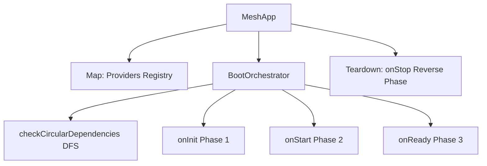
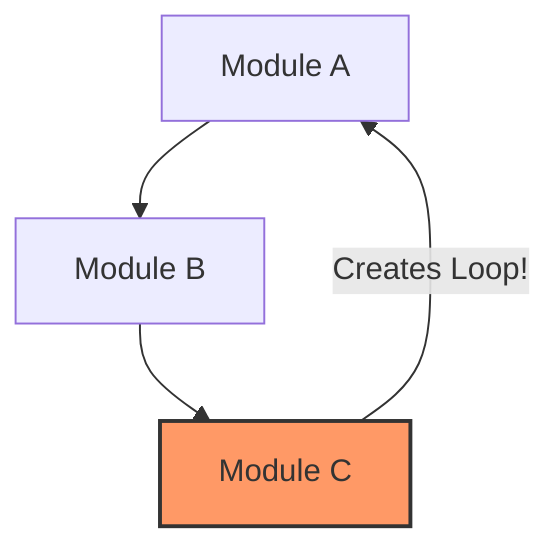

# Core Engine & Lifecycle Specification

## Overview
The Mesh Core Engine serves as the core coordinator ("motherboard") of a node. It handles type-safe Dependency Injection (DI), schedules isomorphic module lifecycles, and resolves startup graphs synchronously while guaranteeing circular-dependency-free boot paths.

---

## Component Architecture



---

## MeshApp (`MeshApp`)

The `MeshApp` is the central containment container for a mesh node.

### 1. Dependency Injection (DI) Registry
Mesh incorporates a strict, lightweight DI container that registers and retrieves dependencies using a provider map.

#### Token Resolution Rules (`getTokenKey`)
To allow maximum developer flexibility while maintaining strict typing, the DI container resolves provider tokens using the following fallback cascade:
1. **String or Symbol**: Direct conversion via `.toString()`.
2. **Objects or Functions with `id`**: If the token contains an `id` property, it is cast to a string.
3. **Class/Function Reference**: Uses `.name` directly, provided it is not the default anonymous `Function` or `Object`.

```typescript
// Registering providers
app.registerProvider<ILogger>('logger', loggerInstance);
app.registerProvider<IMeshApp>('app', appInstance);

// Retrieving providers
const logger = app.getProvider<ILogger>('logger');
```

---

## Boot Orchestrator (`BootOrchestrator`)

The `BootOrchestrator` schedules the multi-phase boot sequence. It ensures that critical low-level elements (transports, databases, buffers) are properly loaded before higher-level services are initialized.

### 1. Boot Phases

#### Phase 1: Initialization (`onInit`)
* **Objective**: Module configuration, kernel dependency injection, and schema collection.
* **Orchestrator Actions**:
  1. Instantiates modules in registered order.
  2. Injects the system `ILogger` and `IServiceBroker` instances directly into the module.
  3. Executes the asynchronous `onInit(app)` hook on each module.
  4. Collects and registers any services or tools exported by the module.

#### Phase 2: Start (`onStart`)
* **Objective**: Socket binding, network handshake, cluster registration.
* **Orchestrator Actions**:
  1. Executes the asynchronous `onStart(app)` hook on each module.
  2. Network adapters bind to ports, and clients trigger bootstrap peer connections.

#### Phase 3: Ready (`onReady`)
* **Objective**: Active operational state, scheduling cron jobs, metric collection.
* **Orchestrator Actions**:
  1. Executes the asynchronous `onReady(app)` hook on each module.
  2. The local node starts heartbeating, signaling availability to other cluster peers.

---

### 2. Teardown Phase (`onStop`)

To prevent memory leaks and dangling socket connections, teardown is performed in **exact reverse order** of module registration.
* **Example**: A Database Module must remain active while the Network Transport is closing, so the Network Transport is stopped *first*, followed by the database connection.

---

## DFS Circular Dependency Checking

Before initiating Phase 1 (`onInit`), the `BootOrchestrator` validates the integrity of the module dependency graph. It performs a **Depth-First Search (DFS)** traversal using two state trackers (`visited` and `stack`).



If the search detects an active node in the traversal path is visited twice on the current path, it aborts the startup sequence immediately by throwing a `MeshError` with the status code `CIRCULAR_DEPENDENCY`.

---

## Code Example: Writing a Custom Module

Here is a concrete example of a custom module that integrates with the engine lifecycle:

```typescript
import { IMeshModule } from '../interfaces/IMeshModule.js';
import { IMeshApp } from '../interfaces/IMeshApp.js';
import { ILogger } from '../interfaces/ILogger.js';
import { IServiceBroker } from '../interfaces/IServiceBroker.js';

export class CacheModule implements IMeshModule {
    public readonly name = 'cache';
    public readonly dependencies = ['logger']; // Declarative dependencies

    public logger!: ILogger;
    public serviceBroker!: IServiceBroker;

    private cacheStore = new Map<string, unknown>();
    private cleanupInterval?: NodeJS.Timeout;

    public async onInit(app: IMeshApp): Promise<void> {
        this.logger.info('[CacheModule] Initializing in-memory cache...');
        
        // Register the cache instance as a DI provider for other modules to use
        app.registerProvider('cache_store', this.cacheStore);
    }

    public async onStart(app: IMeshApp): Promise<void> {
        this.logger.info('[CacheModule] Starting cache eviction loops...');
        this.cleanupInterval = setInterval(() => {
            this.logger.debug('[CacheModule] Purging expired entries...');
            // Eviction logic
        }, 60000);
        
        if (this.cleanupInterval.unref) {
            this.cleanupInterval.unref();
        }
    }

    public async onReady(app: IMeshApp): Promise<void> {
        this.logger.info('[CacheModule] Cache is fully operational and ready.');
    }

    public async onStop(app: IMeshApp): Promise<void> {
        this.logger.info('[CacheModule] Stopping cache and clearing active timers...');
        if (this.cleanupInterval) {
            clearInterval(this.cleanupInterval);
        }
        this.cacheStore.clear();
    }
}
```
