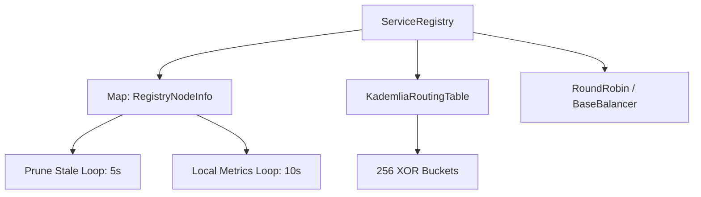
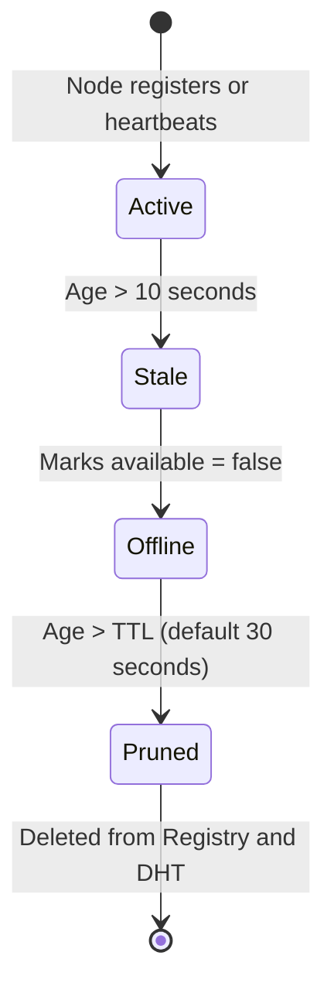

# Discovery & Service Registry Specification

## Overview
The `ServiceRegistry` is the distributed ledger of the Mesh cluster. It maintains a consistent, real-time view of all active nodes, their capabilities, health metrics, and the services they provide. It dynamically organizes nodes using a logical peer-to-peer overlay, enabling load balancing and service routing.

---

## Component Topology



---

## Data Structures

The registry relies on the following schema structures:

### 1. `RegistryNodeInfo`
```typescript
interface RegistryNodeInfo {
    nodeID: string;            // Unique identifier
    type: 'node' | 'client';   // Role type
    namespace: string;         // Logical isolation layer (default: 'default')
    addresses: string[];       // Active transport connection strings (e.g. ws://127.0.0.1:8001)
    services: ServiceInfo[];   // Array of hosted services
    capabilities: Record<string, unknown>; // Network features (e.g. { transports: ['ws'], features: ['relay'] })
    pid: number;               // Process ID (0 in browser)
    cpu: number;               // Last calculated CPU utilization percentage (0 - 100)
    activeRequests: number;    // RAM RSS usage indicator in Node, or mock in browser
    healthScore: number;       // Computed float (0.0 to 1.0)
    timestamp: number;         // Last heartbeat arrival timestamp
    available: boolean;        // Active routing status
    nodeSeq: number;           // Monotonically increasing sequence count to prevent out-of-order state overwrites
}
```

### 2. `ServiceInfo` & `ToolInfo`
```typescript
interface ServiceInfo {
    name: string;              // Domain of the service (e.g., "demo")
    version: string;           // Semantic version
    tools: Record<string, ToolInfo>; // Action lookup map
}

interface ToolInfo {
    name: string;              // Full tool key (e.g., "demo.hello")
    visibility: 'public' | 'private';
    metadata: {
        description: string;
        isCrud?: boolean;
        destructive?: boolean;
    };
}
```

---

## Kademlia DHT XOR Routing

For peer organization and location routing, the registry uses a `KademliaRoutingTable`.

### 1. XOR Distance Metric
The distance between two nodes $x$ and $y$ is computed as the bitwise exclusive-OR (XOR) of their BigInt representations:

$$d(x, y) = x \oplus y$$

String IDs are mapped to 256-bit BigInts by hex-encoding the character codes and padding/clipping to 64 hex characters:

```typescript
const getBigIntID = (id: string): bigint => {
    let hex = '';
    for (let i = 0; i < id.length; i++) {
        hex += id.charCodeAt(i).toString(16).padStart(2, '0');
    }
    return BigInt('0x' + hex.padEnd(64, '0').slice(0, 64));
};
```

### 2. Bucket Organization
The routing table maintains **256 buckets**, where each bucket represents a distance interval. Node distance $d$ falls into bucket index $i$:

$$i = \lfloor \log_2(d) \rfloor$$

In TypeScript, this index is computed by finding the length of the binary string representation of the XOR value:

```typescript
const getBucketIndex = (distance: bigint): number => {
    if (distance === BigInt(0)) return 0;
    return Math.min(255, distance.toString(2).length - 1);
};
```

* **Bucket Capacity ($K$-Value)**: Buckets are capped at $K = 20$ nodes. When a bucket is full, the least-recently seen node is verified, and the new peer is discarded or appended according to activity checks.

---

## Health Scoring & Metrics Collection

The registry spawns a metrics-polling loop every **10 seconds** (`updateLocalMetrics`) to calculate node load:

### 1. Mathematical Health Score Model
The local health score $H$ is a normalized value between $0.0$ (overloaded) and $1.0$ (fully healthy), calculated based on CPU and request ratios:

$$H = \max\left(0.0, 1.0 - \frac{\text{CPU}\%}{100} - \frac{\text{RAM\_RSS\_MB}}{50}\right)$$

### 2. Node.js System Polling
In Node.js runtimes, the registry reads system APIs:
* **CPU Util**: Calculated using 1-minute load averages normalized over CPU core count (`os.cpus()`, `os.loadavg()`).
* **RAM indicator**: Reads the process Resident Set Size in MB (`process.memoryUsage().rss`).

---

## Stale-Node Detection & Pruning

The registry runs a background pruning loop every **5 seconds** (`pruneStaleNodes`):



* **Offline Transition**: If no heartbeat arrives for **10 seconds**, the registry marks the node as `available = false` and prints: `"Node offline (missed heartbeats): <nodeID>"`.
* **Prune Eviction**: If a node remains inactive for longer than the **TTL** (default: 30 seconds), it is permanently removed from the active nodes map and the `KademliaRoutingTable`.

---

## Promise-Based Wait Helpers

To synchronize distributed application startup, the registry exports three promise-based event listeners with standard timeouts:

```typescript
import { Registry } from '../core/Registry.js';
import { Logger } from '../utils/Logger.js';

async function bootstrapServices() {
    const registry = new Registry(new Logger());
    await registry.start();

    try {
        // 1. Wait for a specific logical service to join the mesh
        await registry.waitForService('database', 15000);
        console.log('Database service discovered!');

        // 2. Wait for a specific tool action to register
        await registry.waitForTool('database.query', 10000);
        console.log('database.query is callable.');

        // 3. Wait for a minimum cluster size before executing actions
        await registry.waitForNodes(3, 20000);
        console.log('At least 3 cluster peers are online.');
    } catch (error) {
        console.error('Bootstrap failed: service discovery timed out.', error);
    }
}
```

---

## Load Balancing
When executing a tool, the registry routes traffic using the following path:
1. **Prefer Local**: If the requested tool is hosted locally on the current node, the call is processed locally, avoiding network overhead.
2. **Strategy Dispatch**: If remote, the registry passes candidates to the mounted `BaseBalancer` (defaults to `RoundRobinBalancer`) to distribute requests evenly among active, healthy peers.
