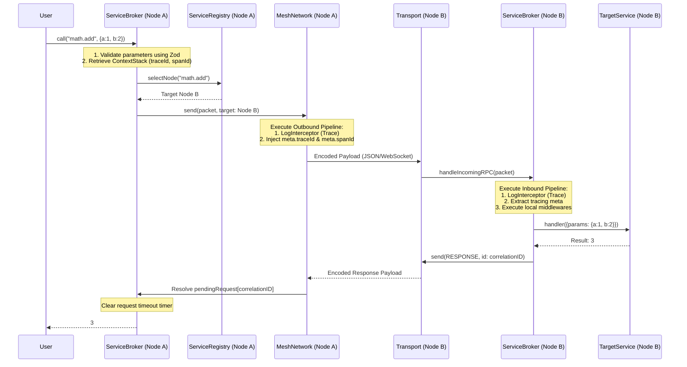
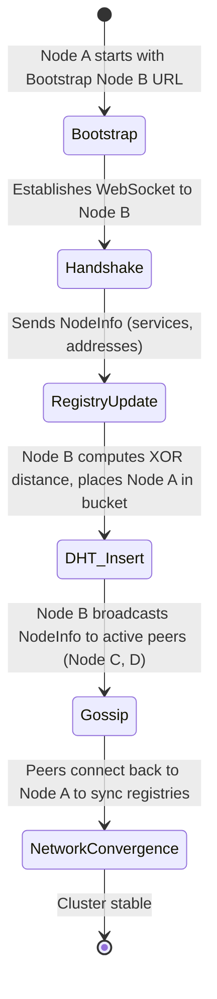
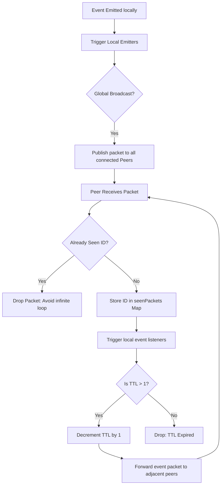
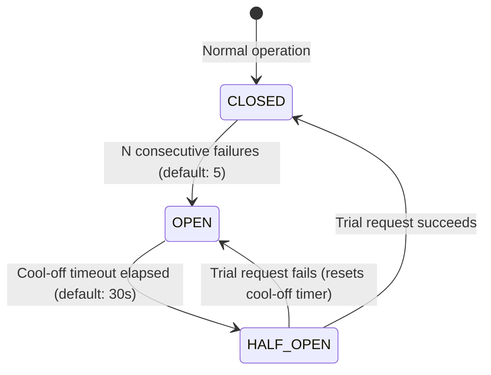

# System Interaction Flows

## 1. Remote RPC Call Sequence

This diagram shows the complete logical and physical path of a `call()` crossing network boundaries, emphasizing interceptor injection and tracing context propagation.

### Trace Context Propagation
To trace requests across multiple distributed hops, the `ServiceBroker` propagates a tracing header block via packet metadata:
* **`traceId`**: Persistent identifier for the root request. Remains identical across all child RPC hops.
* **`spanId`**: Unique identifier for the current execution step.
* **`parentId`**: The `spanId` of the caller context. Used to reconstruct call trees.

---

## 2. Peer Discovery & DHT Join Flow

When a new node joins a cluster, it must announce its local services and learn about other peers.

1. **Bootstrap Handshake**: Node A opens a socket to the bootstrap peer (Node B) and transmits a packet containing its full `NodeInfo` (supported transports, namespaces, services, and tool capabilities).
2. **Registry Insertion**: Node B registers Node A locally, generating a `'changed'` event to notify local listeners.
3. **DHT Allocation**: Node B calculates the binary XOR distance and places Node A in the corresponding bucket.
4. **Active Gossip Broadcast**: Node B acts as a relay, flooding Node A's presence packet to its immediate peers.
5. **Direct Connect**: Peers (like Node C) receive the announcement, insert Node A into their registries, and establish direct WebSockets to Node A, achieving network convergence.

---

## 3. Event Flooding (Pub/Sub) Mechanics

To broadcast event messages without centralized message brokers, Mesh uses a flooding protocol. Loop prevention is managed through packet identification and Time-To-Live (TTL) boundaries.

---

## 4. Circuit Breaker State Transitions

The circuit breaker prevents cascading cluster failures by monitoring RPC error rates. It implements a finite state machine:

* **`CLOSED` (Normal)**: All traffic is routed directly to the transport layer.
* **`OPEN` (Tripped)**: The remote node is failing. The outbound pipeline intercepts outgoing requests to the failing node and raises an immediate `Circuit open` error locally, avoiding network timeouts.
* **`HALF_OPEN` (Recovery Trial)**: A single trial request is permitted through the network:
  * **Success**: The remote node is deemed healthy; state returns to `CLOSED` and the failure counter is reset.
  * **Failure**: The breaker immediately returns to `OPEN` and resets the 30-second cool-off timer.
