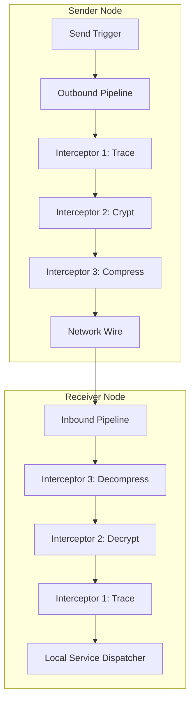

# Interceptors & Middleware Specification

## Overview
Interceptors provide a powerful hook system to intercept, inspect, modify, or block network packets. They are implemented using the **decorator pattern** and are structured as sequential execution pipelines for inbound and outbound traffic.

---

## Pipeline Execution Architecture



* **Outbound Pipeline**: Executed when a packet is sent to the network, running in registered order.
* **Inbound Pipeline**: Executed when a packet is received from the transport, running in **reverse registered order** to ensure symmetric processing (e.g., decrypting a payload before decompressing it).

---

## The `IInterceptor` Interface

Every interceptor must implement the isomorphic `IInterceptor` interface:

```typescript
import { MeshPacket } from '../interfaces/IMeshNetwork.js';

export interface IInterceptor<TIn = MeshPacket, TOut = MeshPacket> {
    readonly name: string;
    
    /** Hook executed for inbound network packets */
    onInbound?(packet: TIn): Promise<TOut> | TOut;
    
    /** Hook executed for outbound network packets */
    onOutbound?(packet: TOut): Promise<TIn> | TIn;
    
    /** Cleanup hooks executed on engine shutdown */
    stop?(): Promise<void> | void;
}
```

---

## Standard Interceptors

### 1. Circuit Breaker (`CircuitBreakerInterceptor`)
Protects remote endpoints by intercepting outbound requests. If a peer is marked offline or overloaded, outbound calls fail immediately without touching the network:
* **Detection**: Increments failures when remote calls time out or reject.
* **Action**: If failures exceed the threshold (default: 5), it changes the outbound packet topic to `__circuit_open`, raising an immediate error in the local broker pipeline.

### 2. Rate Limiter (`RateLimitInterceptor`)
Protects the local node from overload by intercepting inbound packets.
* **Action**: Tracks incoming requests in a sliding window. Excess packets are intercepted, and their topic is set to `__dropped` to block execution.

### 3. Compression (`CompressionInterceptor`)
Minimizes network bandwidth usage for large payloads.
* **Action**:
  * **Server**: Compresses using Gzip.
  * **Browser**: Performs no-op or lightweight compression.
  * Injects `compressed = true` metadata into the packet header.

### 4. Trace Interceptor (`TraceInterceptor`)
Maintains distributed tracing context across remote networks.
* **Action**: Injects tracing spans (`traceId`, `spanId`) into outbound packet headers and parses them from inbound headers.

---

## Code Example: Writing a Custom Authentication Interceptor

The following example demonstrates a custom, type-safe security interceptor that verifies HMAC signatures on all incoming and outgoing event packets:

```typescript
import { IInterceptor } from '../interfaces/IInterceptor.js';
import { MeshPacket } from '../interfaces/IMeshNetwork.js';
import { crypto } from '../utils/crypto.js'; // Isomorphic crypto module

export class SecurityInterceptor implements IInterceptor<MeshPacket, MeshPacket> {
    public readonly name = 'hmac-security';

    constructor(private sharedSecret: string) {}

    /**
     * Inbound: Verify that the packet signature matches the payload.
     */
    public async onInbound(packet: MeshPacket): Promise<MeshPacket> {
        // Bypass verification for internal protocol packets
        if (packet.topic.startsWith('kademlia.') || packet.topic.startsWith('raft.')) {
            return packet;
        }

        const signature = packet.meta?.signature;
        if (!signature || typeof signature !== 'string') {
            throw new Error(`[Security] Dropping unsigned packet on topic: ${packet.topic}`);
        }

        const dataString = JSON.stringify(packet.data || {});
        const computedSig = crypto.createHmac('sha256', this.sharedSecret)
            .update(packet.id + dataString)
            .digest('hex');

        if (computedSig !== signature) {
            throw new Error(`[Security] Packet verification failed for packet: ${packet.id}`);
        }

        return packet;
    }

    /**
     * Outbound: Sign the packet before transmitting it over the wire.
     */
    public async onOutbound(packet: MeshPacket): Promise<MeshPacket> {
        // Bypass signing for internal control packets
        if (packet.topic.startsWith('kademlia.') || packet.topic.startsWith('raft.')) {
            return packet;
        }

        const dataString = JSON.stringify(packet.data || {});
        const signature = crypto.createHmac('sha256', this.sharedSecret)
            .update(packet.id + dataString)
            .digest('hex');

        packet.meta = {
            ...packet.meta,
            signature
        };

        return packet;
    }
}
```

---

## Registering Interceptors

Interceptors are registered in the network configuration during bootstrap:

```typescript
import { MeshNetwork } from '../core/MeshNetwork.js';
import { SecurityInterceptor } from './SecurityInterceptor.js';

const network = new MeshNetwork({
    nodeId: 'node-1',
    transports: [new WebSocketTransport()],
    port: 8000
}, logger, registry);

// Register interceptors
network.use(new SecurityInterceptor('super-secret-key'));
```
