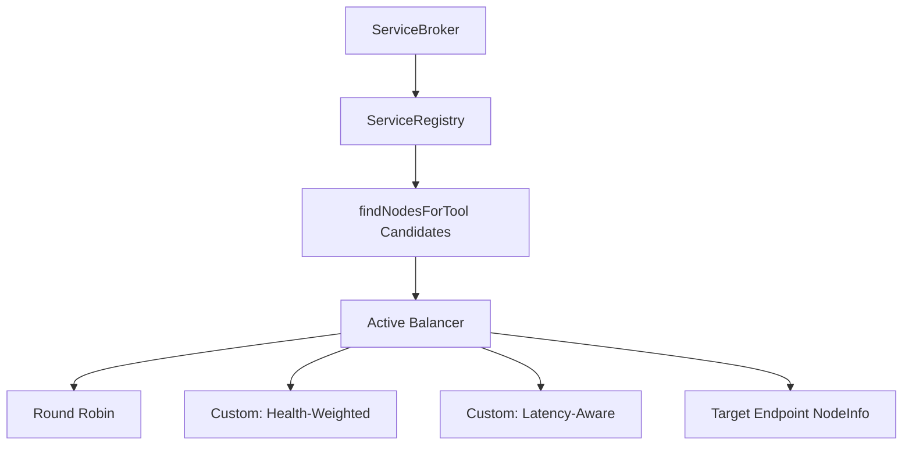
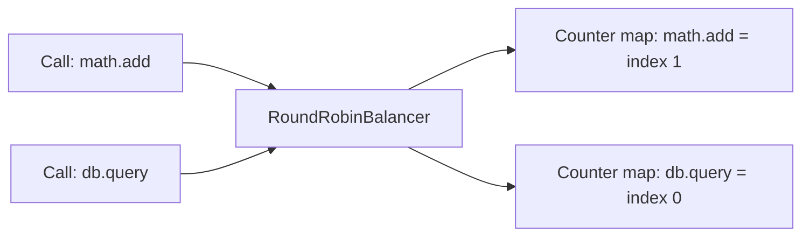

# Load Balancing Specification

## Overview
When a client invokes a service method that is hosted on multiple nodes, the mesh must select the best endpoint candidate. Mesh implements client-side load balancing, decoupling routing logic from network protocol handlers.

By executing selection algorithms locally on the client registry, Mesh avoids the hop penalty of centralized reverse proxies, directly establishing point-to-point calls.

---

## Component Topology



---

## The `BaseBalancer` Abstract Class

Custom load balancing strategies extend `BaseBalancer` and implement the abstract `select` method:

```typescript
import { NodeInfo } from '../types/registry.schema.js';

export abstract class BaseBalancer {
    /**
     * select: Choose a single target NodeInfo from candidate nodes.
     * @param nodes Array of healthy, available candidate nodes hosting the service
     * @param ctx Call context containing execution details (e.g. toolName, params)
     */
    abstract select(nodes: NodeInfo[], ctx?: Record<string, unknown>): NodeInfo | null;
}
```

---

## Standard Balancer: Round Robin

The standard balancer is `RoundRobinBalancer`. It distributes requests sequentially to ensure uniform load distribution across all candidate nodes.

### 1. Per-Action Counters
To prevent hot-spotting (where a busy tool blocks requests to other idle tools), the balancer isolates counters using the tool key (`ctx.toolName`):



### 2. Memory Leak Protection
To prevent unbounded memory growth in dynamic environments where tool keys are dynamically generated, the balancer caps its tracking structure:
* **Cap threshold**: 1,000 unique keys.
* **Action**: If the counter map size exceeds 1,000 and the arriving key is not tracked, the entire counter map is cleared (`this.counters.clear()`), resetting counters safely without impacting routing correctness.

---

## Implementing a Custom Balancer

Developers can implement custom balancing strategies by extending the base class. The following example demonstrates a custom, fully-typed **Weighted Health Balancer** that selects targets based on real-time node health metrics (`healthScore`):

```typescript
import { BaseBalancer } from './BaseBalancer.js';
import { NodeInfo } from '../types/registry.schema.js';

export class WeightedHealthBalancer extends BaseBalancer {
    /**
     * Selects a node using fitness-proportionate selection (Roulette Wheel).
     * Nodes with higher health scores (near 1.0) have a higher chance of selection.
     */
    public select(nodes: NodeInfo[], ctx?: Record<string, unknown>): NodeInfo | null {
        if (nodes.length === 0) return null;
        if (nodes.length === 1) return nodes[0];

        // 1. Calculate the sum of all health scores
        let totalHealth = 0;
        for (const node of nodes) {
            // Default to 1.0 (fully healthy) if score is missing
            totalHealth += node.healthScore !== undefined ? node.healthScore : 1.0;
        }

        // 2. If all nodes have a health score of 0, fallback to standard Round-Robin selection
        if (totalHealth === 0) {
            const index = Math.floor(Math.random() * nodes.length);
            return nodes[index];
        }

        // 3. Generate a random fitness threshold
        const target = Math.random() * totalHealth;
        let cumulativeHealth = 0;

        // 4. Select the node whose score matches the threshold
        for (const node of nodes) {
            const health = node.healthScore !== undefined ? node.healthScore : 1.0;
            cumulativeHealth += health;
            if (cumulativeHealth >= target) {
                return node;
            }
        }

        // Safety fallback: return last node
        return nodes[nodes.length - 1];
    }
}
```

---

## Configuring Balancers in the Registry

To mount your custom balancing strategy, pass it to the registry instance during bootstrap:

```typescript
import { Registry } from '../core/Registry.js';
import { WeightedHealthBalancer } from './WeightedHealthBalancer.js';
import { Logger } from '../utils/Logger.js';

const logger = new Logger();
const registry = new Registry(logger, {
    localNodeID: 'node-client',
    preferLocal: false // Force load balancer evaluation for testing
});

// Configure the registry to use your custom balancer
registry.setBalancer(new WeightedHealthBalancer());

await registry.start();
```
