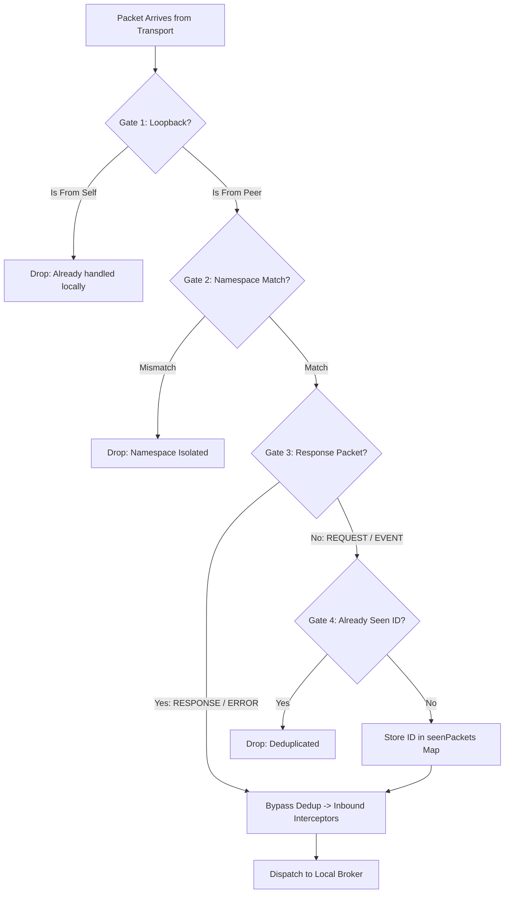

# Networking Layer Specification

## Overview
The `MeshNetwork` component manages the cluster networking layer. It handles packet serialization, peer-to-peer connection routing, namespace isolation, loopback suppression, seen-packet deduplication, and inbound/outbound interceptor pipelines.

---

## Packet Filtering Architecture

Incoming packets must pass through four distinct validation gates before they are accepted and dispatched to local services:



---

## Core Validation Gates

### Gate 1: Loopback Suppression
To prevent message loops, the network drops any packet originating from the local node ID (`packet.senderNodeID === this.nodeID`) that arrives via the transport layer. 

* *Why?* The local `ServiceBroker` already handles local tool calls and events instantly within the local process. Any local packet entering the network layer is meant exclusively for remote peers.

### Gate 2: Namespace Isolation
Mesh networks support logical partitioning. Nodes ignore packets from a different namespace:
```typescript
if (packet.namespace && packet.namespace !== this.namespace) {
    return; // Silently dropped
}
```

### Gate 3: Response Packet Deduplication Exemption
Request and Response packets share the same unique ID (`packet.id`). To prevent response packets from being incorrectly discarded as duplicate requests, `RESPONSE` and `RESPONSE_ERROR` packets bypass deduplication checks entirely:

```typescript
const isResponse = packet.type === 'RESPONSE' || packet.type === 'RESPONSE_ERROR';
if (!isResponse && this.seenPackets.has(packet.id)) {
    return; // Duplicate request/event dropped
}
```

### Gate 4: Seen-Packet Deduplication
To prevent broadcast storms in gossip meshes, `MeshNetwork` tracks the IDs of all processed requests and events.

* **Cache storage**: IDs are recorded in `seenPackets` mapped to an expiration timestamp.
* **TTL configuration**: Packet IDs are kept in memory for **10 seconds** (`PACKET_TTL_MS = 10000`).
* **Cleanup scheduler**: A background timer runs every **5 seconds** to prune expired entries, preventing memory leaks:

```typescript
this.cleanupTimer = setInterval(() => {
    const now = Date.now();
    for (const [id, expiry] of this.seenPackets.entries()) {
        if (now > expiry) {
            this.seenPackets.delete(id);
        }
    }
}, 5000);
```

---

## Establishing Peer-to-Peer Connections

Nodes connect directly to each other to build a peer-to-peer network. In Node.js environments, a unified server handles connections; in browser environments, connection setup is delegated to client transports.

```typescript
import { MeshNetwork } from '../core/MeshNetwork.js';
import { WebSocketTransport } from '../transports/WebSocketTransport.js';
import { Logger } from '../utils/Logger.js';
import { Registry } from '../core/Registry.js';

async function setupNetworkNode() {
    const logger = new Logger();
    const registry = new Registry(logger);

    // Initialize Network instance
    const network = new MeshNetwork({
        nodeId: 'node-alpha',
        namespace: 'staging',
        bootstrapNodes: ['ws://127.0.0.1:8000'],
        transports: [new WebSocketTransport()],
        port: 8001
    }, logger, registry);

    await network.start();

    // Dynamically connect directly to a remote peer (Node Beta)
    await network.connectToPeer('node-beta', 'ws://127.0.0.1:8002');
    
    // Broadcast a custom event to all connected peers
    await network.publish('chat.message', {
        user: 'Alpha',
        text: 'Hello Mesh!'
    });
}
```
---

## Outbound Packet Prioritization

When transmitting packets, the network prioritizes control plane messages. Internal system topics (such as those starting with `raft.` or `kademlia.`) are automatically assigned priority **2**, ensuring they bypass regular application traffic queues.
