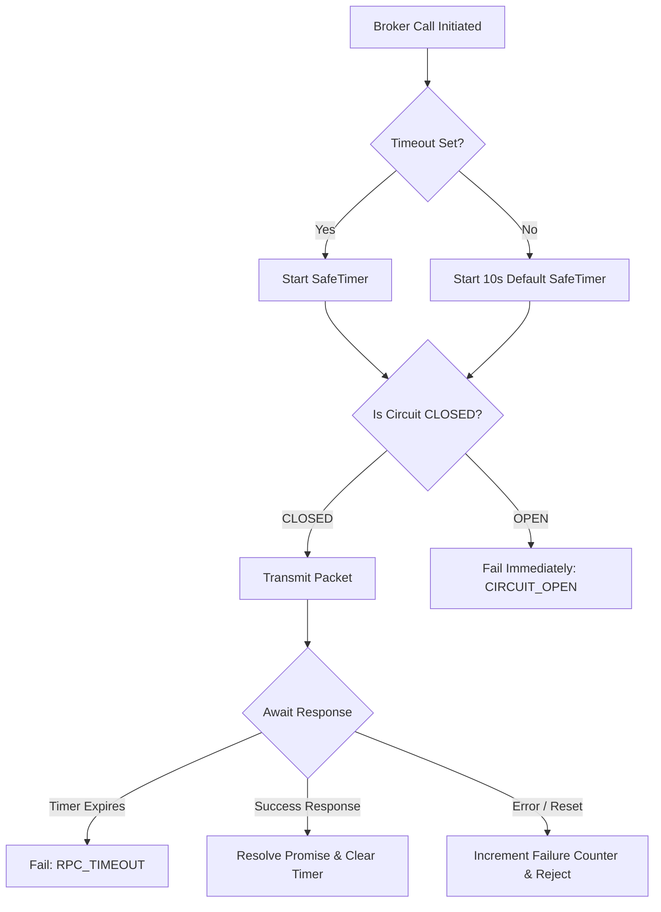

# Resilience & Fault Tolerance Guide

## Overview
Distributed systems are prone to partial failures, network partitions, and cascading resource exhaustion. Mesh incorporates native resilience primitives—including client-side timeouts, circuit breakers, rate limiters, and self-healing registries—to isolate and tolerate faults.

---

## 1. Request Resiliency Mechanics



### 1. Client-Side Timeouts
Every RPC call is governed by a timeout to prevent caller threads from blocking indefinitely on dead nodes:
* **Default duration**: 10,000ms.
* **Granular Configuration**: Timeouts can be configured globally, in the tool's contract, or on a per-call basis:

```typescript
// 1. Contract-level declaration
export const queryContract = defineContract({
    domain: 'db',
    action: 'query',
    inputSchema: z.object({ sql: z.string() }),
    outputSchema: z.any(),
    timeout: 5000 // 5 seconds timeout limit
});

// 2. Call-level override
const result = await app.call('db.query', { sql: 'SELECT * FROM users' }, {
    timeout: 2000 // Override to 2 seconds
});
```

Enforcement is managed by the `ServiceBroker` using a custom, high-precision `SafeTimer` utility. When a timeout occurs, the request promise is rejected with an `RPC_TIMEOUT` error.

---

### 2. Circuit Breakers (`CircuitBreakerInterceptor`)
To prevent cascading failures across the cluster, Mesh isolates unstable nodes:
* **Failure Trigger**: 5 consecutive failed requests (network failures, rejections, or timeouts) targeting the same node.
* **Fallback Action**: Trips the breaker to `OPEN`. Outbound calls to the failing node fail immediately with a `CIRCUIT_OPEN` error, bypassing the network.
* **Cool-off Period**: Keeps the circuit `OPEN` for 30 seconds.
* **Self-Healing**: After 30 seconds, transitions to `HALF_OPEN`. The next outbound request acts as a probe:
  * **Success**: Restores the state to `CLOSED` and resets failure counters.
  * **Failure**: Re-trips the state to `OPEN` and resets the 30-second cool-off timer.

---

## 2. Resource Resilience

### 1. Inbound Rate Limiting
To protect nodes from being overwhelmed by traffic spikes or misconfigured peers, the `RateLimitInterceptor` monitors inbound volume.
* **Default Threshold**: 1,000 packets per 60-second window per `senderNodeID`.
* **Action**: Packets exceeding the threshold have their topic changed to `__dropped` and are silently discarded at the network boundary, preserving CPU and memory.

---

## 3. Error Hierarchy & Handling

Mesh categorizes faults using structured error objects extending `MeshError`. This allows developers to implement granular recovery logic:

| Error Code | HTTP Status | Root Cause | Recommended Recovery Strategy |
|---|---|---|---|
| `CIRCULAR_DEPENDENCY` | `500` | Dependency loop detected during startup | Fix module dependencies in the code |
| `MESH_DISCOVERY_ERROR` | `404` | Service/Action not found in registry | Wait for service or verify network joins |
| `RPC_TIMEOUT` | `408` | No response within the timeout limit | Retry with exponential backoff or inspect target node |
| `CIRCUIT_OPEN` | `503` | Target node is currently blacklisted | Fail fast; route to fallback replica or cache |
| `VALIDATION_ERROR` | `400` | Params do not match Zod input schema | Correct caller arguments or update contract |
| `TRANSPORT_ERROR` | `502` | Physical network channel failed | Reconnect network adapter automatically |

### Code Example: Fault-Tolerant RPC Handlers

The following example demonstrates how to implement a resilient, retrying caller that handles timeouts, circuit breaker exceptions, and service discovery issues with exponential backoff:

```typescript
import { MeshApp } from '../core/MeshApp.js';
import { Logger } from '../utils/Logger.js';

const app = new MeshApp({ nodeID: 'resilient-client' });

async function callWithRetry(action: string, params: any, retries = 3, delayMs = 1000): Promise<any> {
    for (let attempt = 1; attempt <= retries; attempt++) {
        try {
            return await app.call(action as any, params);
        } catch (error: any) {
            const isLastAttempt = attempt === retries;

            if (error.code === 'VALIDATION_ERROR' || error.code === 'CIRCULAR_DEPENDENCY') {
                // Do not retry developer bugs or input validation errors
                throw error;
            }

            if (error.code === 'CIRCUIT_OPEN') {
                console.warn(`[Client] Circuit open for ${action}. Falling back to cache...`);
                return getFallbackCacheValue(action, params);
            }

            if (isLastAttempt) {
                throw new Error(`Failed to call ${action} after ${retries} attempts. Last error: ${error.message}`);
            }

            const backoff = delayMs * Math.pow(2, attempt - 1);
            console.warn(`[Client] Attempt ${attempt} failed (${error.code || error.message}). Retrying in ${backoff}ms...`);
            await new Promise(resolve => setTimeout(resolve, backoff));
        }
    }
}

function getFallbackCacheValue(action: string, params: any) {
    return { fallback: true, data: [] };
}
```
