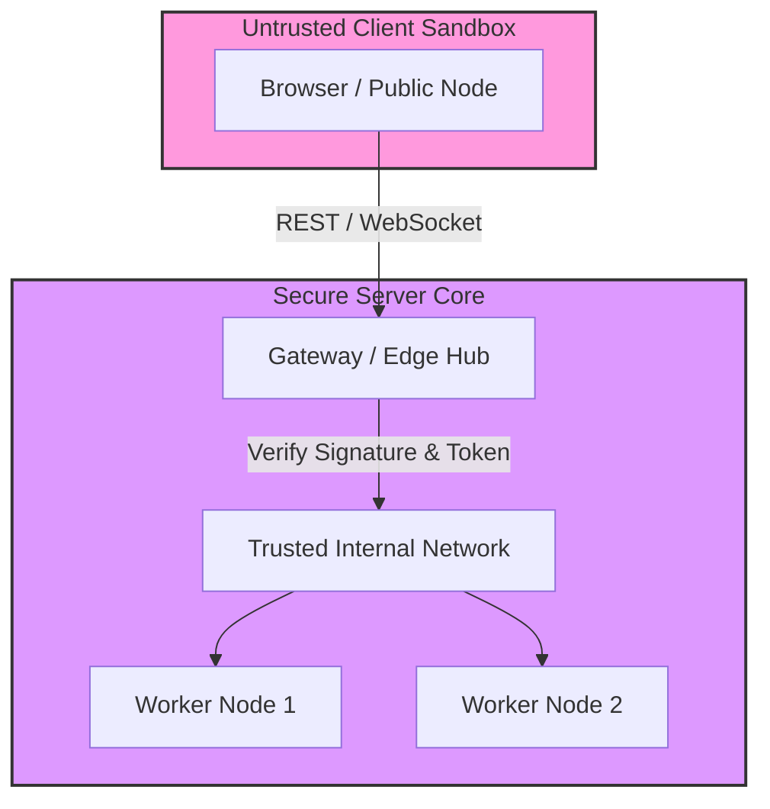

# Security & Cryptography Specification

## Overview
Mesh is isomorphic, meaning it runs on servers and in untrusted client browsers. Consequently, the network must enforce strict boundaries, message verification, and sandboxed execution environments.

---

## Security Model



---

## 1. Node Trust Levels

The system categorizes connected nodes into two logical trust levels:

### `internal` (Server-Side Core Nodes)
* **Description**: Backend servers, hubs, or workers running in secure cloud environments.
* **Capabilities**: Direct access to local storage, full CRUD operations, and cross-domain events.
* **Network Role**: Direct peer-to-peer connection paths via TCP, NATS, or local WebSockets.

### `public` (Client-Side Sandboxed Nodes)
* **Description**: Web browser clients, mobile devices, or external API consumers.
* **Capabilities**: Restricted to sandboxed client RPCs. All local filesystems and operating system operations are disabled.
* **Network Role**: Connect as leaf nodes through gateways; prevented from acting as multi-node relay nodes.

---

## 2. Sandbox Jailing & Path Resolution

To prevent directory traversal attacks and host OS mutations in backend actions, all server-side tools that touch files or processes must execute in a jailed container.

### Path Isolation via `getSandbox`
Sever-side executors resolve filesystem paths exclusively using a sandbox context:

```typescript
import { IServiceContext } from '../interfaces/IServiceContext.js';
import path from 'path';

export async function writeFileTool(
    input: { filename: string; content: string },
    ctx: IServiceContext
): Promise<{ success: boolean; resolvedPath: string }> {
    
    // 1. Resolve path using getSandbox context
    // This blocks access to folders outside the allowed directory structure (e.g. /etc/passwd)
    const sandboxDir = ctx.sandbox.getSandbox(); 
    
    const targetPath = path.resolve(sandboxDir, input.filename);
    
    // Double check that resolved path is inside sandbox directory
    if (!targetPath.startsWith(sandboxDir)) {
        throw new Error(`[Security] Directory traversal detected: ${input.filename}`);
    }
    
    // Safe write operation
    await ctx.fs.writeFile(targetPath, input.content);
    
    return { 
        success: true, 
        resolvedPath: targetPath 
    };
}
```

---

## 3. Payload Signing & HMAC Verification

To verify packet authenticity without the overhead of asymmetric handshakes for every packet, Mesh supports isomorphic HMAC signing for internal communications.

```typescript
import { z } from 'zod';
import { defineContract } from '../interfaces/IToolContract.js';

export const secureActionContract = defineContract({
    domain: 'admin',
    action: 'shutdown',
    inputSchema: z.object({ force: z.boolean() }),
    outputSchema: z.object({ success: z.boolean() }),
    
    // Signals to the outbound pipeline to enforce high-security requirements
    destructive: true 
});
```

* **Action**: If a tool is marked `destructive: true`, the outbound pipeline requires HMAC headers. Incoming packets lacking valid signatures are dropped at the network boundary.

---

## 4. Transport Layer Security (TLS)
* **Server**: WebSockets run over Secure WebSockets (`wss://`). The Hub uses certificates (`key.pem`, `cert.pem`) to terminate TLS.
* **Browser**: Browser runtimes are protected by the same-origin policy and default browser TLS termination.
