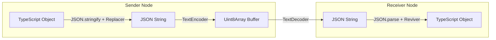

# Serialization Specification

## Overview
Mesh is an isomorphic network library, meaning it must serialize structured data packets into byte buffers for network transport and parse them back at their destinations. Mesh achieves this by defining a pluggable serializer architecture.

---

## Serialization Flow



---

## The `BaseSerializer` Interface

All serialization engines inherit from the `BaseSerializer` abstract class:

```typescript
export abstract class BaseSerializer {
    /** Unique serializer format identifier (e.g. 'json', 'protobuf') */
    abstract readonly type: string;

    /**
     * serialize: Encodes a JavaScript value into a binary buffer.
     * @param data Payload object to transmit
     */
    abstract serialize(data: unknown): Uint8Array;

    /**
     * deserialize: Decodes a binary buffer or string back into a typed object.
     * @param buf Raw buffer, string, or ArrayBuffer
     */
    abstract deserialize<T>(buf: Uint8Array | ArrayBuffer | string): T;
}
```

---

## Standard Serializer: Isomorphic JSON

The default serialization engine is the `JSONSerializer`. It uses modern, standard Web APIs (`TextEncoder` and `TextDecoder`) which are natively supported in both Node.js and web browsers.

### 1. Isomorphic Node.js Buffer Preservation
JSON does not natively support binary buffer formats (like Node's `Buffer` or browser `Uint8Array` arrays). The `JSONSerializer` solves this by mounting custom `replacer` and `reviver` mapping functions:

* **Serialization replacer**: Intercepts `Buffer` objects and translates them into a JSON-safe struct:
  ```json
  { "type": "Buffer", "data": [72, 101, 108, 108, 111] }
  ```
* **Deserialization reviver**: Detects the `{ type: "Buffer" }` signature and reconstructs a proper `Buffer` object using `Buffer.from(value.data)`.

---

## Alternative Serializers

Mesh supports alternative serializers for high-throughput or low-bandwidth environments:

1. **`ProtoBufSerializer`** (`protobuf`): Converts payloads into highly-optimized binary structures using predefined Protocol Buffer schemas.
2. **`BinarySerializer`** (`binary`): A lightweight, specialized binary format designed for streaming raw files or video buffers.

---

## Code Example: Serializing custom packets

The following example demonstrates how to serialize and deserialize a `MeshPacket` containing complex binary buffer types using the isomorphic `JSONSerializer`:

```typescript
import { JSONSerializer } from '../serializers/JSONSerializer.js';
import type { MeshPacket } from '../interfaces/IMeshNetwork.js';

function testSerialization() {
    const serializer = new JSONSerializer();

    // 1. Construct a packet containing a Node.js Buffer
    const originalPacket: MeshPacket = {
        id: 'pkg-100',
        topic: 'file.upload',
        type: 'REQUEST',
        senderNodeID: 'node-client',
        timestamp: Date.now(),
        version: 1,
        priority: 1,
        data: {
            filename: 'document.txt',
            // Raw binary data
            content: Buffer.from('Hello world, this is mesh binary!'), 
        }
    } as MeshPacket;

    console.log('Original Packet:', originalPacket.data);

    // 2. Serialize to Uint8Array bytes
    const binaryBuffer: Uint8Array = serializer.serialize(originalPacket);
    console.log(`Serialized Size: ${binaryBuffer.length} bytes`);

    // 3. Deserialize back into a typed packet
    const parsedPacket = serializer.deserialize<MeshPacket>(binaryBuffer);
    
    // The content field is parsed back as a fully functional Buffer object
    console.log('Deserialized Packet:', parsedPacket.data);
    
    const isBuffer = Buffer.isBuffer(parsedPacket.data.content);
    console.log(`Content is a valid Node.js Buffer: ${isBuffer}`);
}
```
