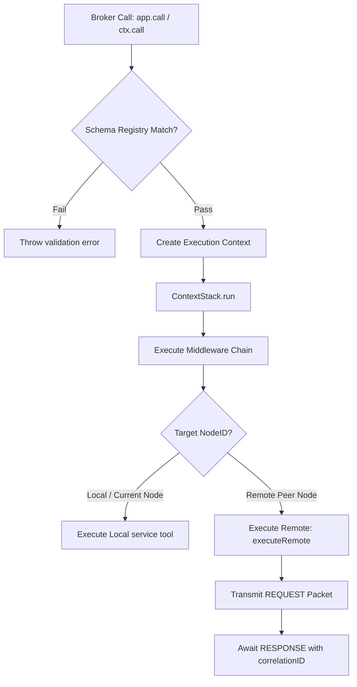
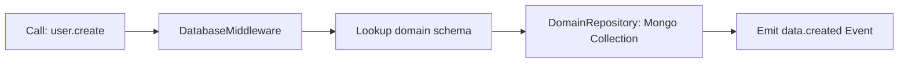

# Service Broker & Routing Specification

## Overview
The `ServiceBroker` acts as the primary request coordinator and communication bus of a Mesh node. It handles registration of local services, maintains execution pipelines (middlewares), manages transaction context propagation, and routes calls locally or bridges them onto the peer-to-peer network.

---

## Routing & Pipeline Architecture



---

## Context Propagation (`ContextStack`)

To support distributed tracing, Mesh provides the `ContextStack` utility. It uses `AsyncLocalStorage` in Node.js (and an isomorphic fallback in browser threads) to preserve execution context down the call tree:

* **Transaction Tracing**: Automatically propagates `traceId` (root transaction ID), `spanId` (current execution ID), and `parentId` (parent step execution ID).
* **Call Inheritance**: If a tool calls another tool via `ctx.call()`, the parent's correlation details are inherited automatically.

---

## Middleware Pipeline Execution

The broker executes registered middleware sequentially via the `executePipeline` (which resolves via `handlePipeline` and `executeChain` internally).

### 1. Registration Hooks
* **`use` (Global Middleware)**: Executed on **every** call, whether it is processed locally or forwarded to a remote peer.
* **`useLocal` (Local Middleware)**: Executed **only** when the target endpoint is resolved to the local node ID.

### 2. Execution Chain Pattern
Each middleware conforms to the standard Onion pattern, accepting a `ctx` context object and a `next` progression function:

```typescript
type IMiddleware = (
    ctx: IContext<Record<string, unknown>, Record<string, unknown>>,
    next: () => Promise<unknown>
) => Promise<unknown>;
```

---

## CRUD Operation Interception

Mesh includes database middleware that intercepts service actions that are marked as CRUD endpoints and translates them to database calls:



* **Action Mapping**: If the action schema has `isCrud: true`, the database middleware intercepts the call and runs the matching database routine:
  * `create` / `create_many` $\to$ repo `create` & emit `data.created`
  * `find` / `find_one` $\to$ repo `find` / `findOne`
  * `update` / `replace` $\to$ repo `update` / `replace` & emit `data.updated`
  * `delete` $\to$ repo `delete` & emit `data.deleted`

---

## Remote Execution Futures

When the broker routes a call to a remote peer, it executes `executeRemote`:

1. Generates a unique `correlationID` for the call.
2. Registers a promise resolver in the internal `pendingRequests` Map.
3. Sets a `SafeTimer` timeout limit (default: 10 seconds).
4. Transmits a `REQUEST` packet via the network layer.
5. When a matching `RESPONSE` or `RESPONSE_ERROR` packet arrives, the promise is resolved or rejected, and the timeout timer is cleared.

---

## Code Example: Registering Middleware & Service Calls

The following example demonstrates how to implement a custom, fully-typed logging middleware, register a database CRUD service, and trigger calls:

```typescript
import { ServiceBroker } from '../core/ServiceBroker.js';
import { Logger } from '../utils/Logger.js';
import { createDatabaseMiddleware } from '../db/DatabaseMiddleware.js';
import { Database } from '../db/Database.js';

async function bootstrapBroker() {
    const logger = new Logger();
    const broker = new ServiceBroker('node-alpha', logger);

    // 1. Register custom execution middleware
    broker.use(async (ctx, next) => {
        const start = Date.now();
        logger.info(`[Pipeline] Calling ${ctx.toolName}...`, { correlationID: ctx.correlationID });
        try {
            const result = await next();
            logger.info(`[Pipeline] ${ctx.toolName} succeeded in ${Date.now() - start}ms`);
            return result;
        } catch (error: any) {
            logger.error(`[Pipeline] ${ctx.toolName} failed: ${error.message}`);
            throw error;
        }
    });

    // 2. Connect Database and mount CRUD middleware
    const db = new Database(logger, 'mongodb://127.0.0.1:27017', 'production');
    await db.connect();
    
    broker.use(createDatabaseMiddleware(broker, db));

    // 3. Execute a typed service tool call
    try {
        const user = await broker.call('user.create', {
            name: 'John Doe',
            email: 'john@example.com'
        });
        console.log('Created User:', user);
    } catch (err) {
        console.error('Call failed:', err);
    }
}
```
