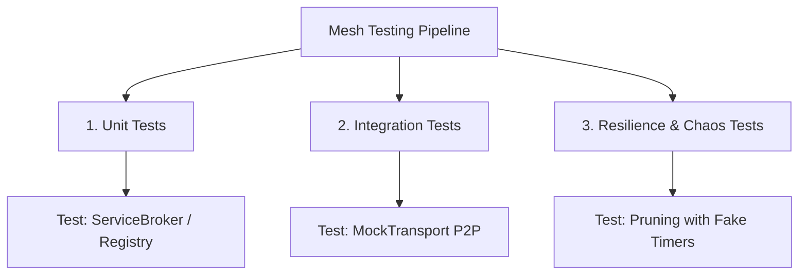

# Testing Strategy Specification

## Overview
Mesh utilizes a strict, resilient testing hierarchy to verify isomorphic execution (Node.js vs. Browser) and cluster fault tolerance. The testing pipeline is built with **Jest** and **ts-jest** for TypeScript compilation check-points.

---

## Testing Tiers



### 1. Unit Tests (`src/**/*.spec.ts`)
* **Scope**: Isolated class behaviors (e.g., verifying `KademliaRoutingTable` bucket indices or `JSONSerializer` buffer transformations).
* **Isolation**: All external components and network layers are strictly mocked using standard Jest mocks or stub providers.

### 2. Integration Tests (`test/**/*.spec.ts`)
* **Scope**: Interaction between core engines (`MeshApp`, `ServiceBroker`, `MeshNetwork`, and `ServiceRegistry`).
* **Mechanism**: Utilizes `MockTransport` to simulate physical networks entirely in-memory, avoiding the overhead of local TCP port binding.

### 3. Resilience & Chaos Tests
* **Scope**: Boundary verification under failure conditions.
* **Scenarios**:
  * Simulating network disconnects to trigger automatic reconnect states.
  * Tripping circuit breakers with consecutive mock timeouts.
  * Flooding nodes with rapid requests to verify sliding-window rate limit triggers.
  * Advancing system clocks via `jest.useFakeTimers()` to verify stale-peer eviction in the registry.

---

## Best Practices

### 1. Time & Timer Mocking
Many Mesh components rely on periodic background timers (such as metrics collection every 10 seconds or peer pruning every 5 seconds).
* **Pruning and TTL Verification**: Use `jest.useFakeTimers()` to instantly fast-forward simulated time:
  ```typescript
  jest.useFakeTimers();
  // Fast forward 30 seconds to trigger node eviction
  jest.advanceTimersByTime(30000); 
  ```
* **Asynchronous Wait Verification**: For test cases involving promise-based wait loops (like `waitForService`), use real timers (`jest.useRealTimers()`) to allow the underlying promise event queue to resolve naturally.

### 2. Isomorphic Validation
Tests must execute correctly across Node.js runtimes and browser environments. Avoid direct imports of Node-specific libraries (like `fs`, `path`, or `os`) inside isomorphic core modules, and use conditional `Env.isNode()` checks to bypass Node-only test fixtures (like raw `UnifiedServer` binds).

---

## Code Example: In-Memory Integration Test

The following example demonstrates a complete integration test using an in-memory `MockTransport` to verify service discovery, P2P network bridge routing, and remote RPC execution between two distinct mock nodes:

```typescript
import { MeshApp } from '../core/MeshApp.js';
import { ServiceBroker } from '../core/ServiceBroker.js';
import { Registry } from '../core/Registry.js';
import { MeshNetwork } from '../core/MeshNetwork.js';
import { BaseTransport } from '../transports/BaseTransport.js';
import { MeshPacket } from '../interfaces/IMeshNetwork.js';
import { Logger } from '../utils/Logger.js';

// 1. Simple In-Memory Mock Transport to link nodes without open ports
class MockTransport extends BaseTransport {
    public readonly type = 'mock';
    public readonly version = 1;
    private static buses = new Map<string, MockTransport>();

    public static route(packet: MeshPacket) {
        const target = this.buses.get(packet.targetNodeID!);
        if (target) {
            target.emit('packet', packet);
        }
    }

    public async connect(opts: any): Promise<void> {
        MockTransport.buses.set(opts.nodeID, this);
        this.emit('connect');
    }

    public async send(nodeID: string, packet: MeshPacket): Promise<void> {
        packet.targetNodeID = nodeID;
        // Direct in-memory routing
        MockTransport.route(packet); 
    }

    public async disconnect(): Promise<void> {
        // Cleanup static map
    }
}

describe('Mesh End-to-End P2P RPC Integration', () => {
    let appA: MeshApp;
    let appB: MeshApp;

    beforeAll(async () => {
        const logger = new Logger(0); // Silent logger

        // Node A Configuration (Caller)
        appA = new MeshApp({ nodeID: 'node-A', logger });
        const regA = new Registry(logger, { localNodeID: 'node-A' });
        const netA = new MeshNetwork({ nodeId: 'node-A', transports: [new MockTransport()] }, logger, regA);
        const brokerA = new ServiceBroker('node-A', logger);
        brokerA.setNetwork(netA);
        brokerA.setRegistry(regA);
        appA.registerProvider('registry', regA);
        appA.registerProvider('broker', brokerA);

        // Node B Configuration (Provider)
        appB = new MeshApp({ nodeID: 'node-B', logger });
        const regB = new Registry(logger, { localNodeID: 'node-B' });
        const netB = new MeshNetwork({ nodeId: 'node-B', transports: [new MockTransport()] }, logger, regB);
        const brokerB = new ServiceBroker('node-B', logger);
        brokerB.setNetwork(netB);
        brokerB.setRegistry(regB);
        appB.registerProvider('registry', regB);
        appB.registerProvider('broker', brokerB);

        // Register a math service tool on Node B
        await brokerB.registerModule({
            domain: 'math',
            getContracts: () => [{
                domain: 'math',
                action: 'square',
                description: 'returns square of number',
                inputSchema: {} as any,
                outputSchema: {} as any,
                destructive: false,
                print: (r: any) => String(r)
            }],
            execute: async (domain, action, params: { n: number }) => {
                return params.n * params.n;
            }
        } as any);

        // Start both applications
        await appA.start();
        await appB.start();

        // Simulate Node B discovery updates on Node A's registry manually
        regA.registerNode({
            nodeID: 'node-B',
            available: true,
            services: [{
                name: 'math',
                version: '1.0.0',
                tools: { 'math.square': { name: 'math.square', visibility: 'public', metadata: {} } }
            }]
        } as any);
    });

    afterAll(async () => {
        await appA.stop();
        await appB.stop();
    });

    it('should successfully route a remote RPC call through the MockTransport', async () => {
        const result = await appA.call('math.square' as any, { n: 8 }, { nodeID: 'node-B' });
        expect(result).toBe(64);
    });
});
```
