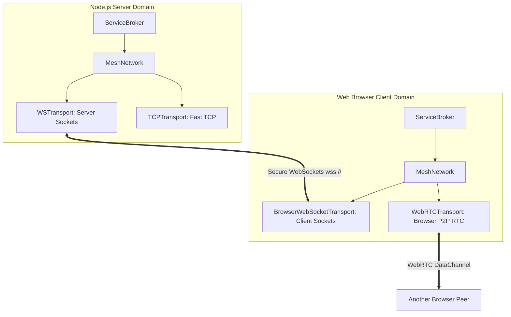

# Transports Specification

## Overview
Transports handle the raw bytes sent between nodes. The `BaseTransport` class abstracts physical network details (TCP sockets, WebSockets, WebRTC, WebWorkers) into a unified isomorphic interface, enabling the core engine to operate independently of the underlying protocol.

---

## Transport Bridges



---

## The `BaseTransport` Abstract Class

All transports extend `BaseTransport` and inherit standard event-emitting capabilities:

```typescript
import { EventEmitter } from 'eventemitter3';
import { BaseSerializer } from '../serializers/BaseSerializer.js';
import { TransportConnectOptions, MeshPacket } from '../interfaces/IMeshNetwork.js';

export abstract class BaseTransport extends EventEmitter {
    abstract readonly protocol: string;
    abstract readonly version: number;

    protected serializer: BaseSerializer;
    protected connected: boolean = false;
    protected nodeID: string = 'unknown';

    constructor(serializer: BaseSerializer) {
        super();
        this.serializer = serializer;
    }

    /** Establish physical socket connections or server binds */
    abstract connect(opts: TransportConnectOptions): Promise<void>;

    /** Gracefully close connections, release sockets, and clear intervals */
    abstract disconnect(): Promise<void>;

    /** Send a point-to-point packet directly to a specific target node */
    abstract send(nodeID: string, packet: MeshPacket): Promise<void>;

    /** Broadcast a packet across a channel or publish to all active peers */
    abstract publish(topic: string, packet: MeshPacket): Promise<void>;

    /** Optional: Establish direct peer-to-peer tunnels (e.g. WebRTC) */
    async connectToPeer(nodeID: string, url: string, options?: Record<string, unknown>): Promise<void> {
        throw new Error(`Transport ${this.protocol} does not support direct peer connections`);
    }
}
```

---

## Isomorphic Transport Implementations

Mesh partitions its transport layers based on execution safety and platform availability:

### 1. Server-Side Node.js Transports (`src/transports/node/`)
* **`TCPTransport`**: A high-performance transport that uses native Node.js TCP sockets (`net`) for fast, low-overhead communication between backend services.
* **`WSTransport`**: Uses the `ws` package to spin up a WebSocket server on a shared port. It handles incoming browser client connections and outgoing peer connections.
* **`IPCTransport`**: Uses Named Pipes / Unix Sockets (`net.connect`) for fast, secure local communication on the same machine.

### 2. Browser Client Transports (`src/transports/browser/`)
* **`BrowserWebSocketTransport`**: Standard browser implementation that uses the isomorphic `WebSocket` Web API to connect to the backend server.
* **`WebRTCTransport`**: Uses WebRTC `RTCDataChannel` to establish direct browser-to-browser P2P tunnels, bypassing backend server relays after initial signaling.
* **`BrowserWorkerTransport`**: Bridges communication between the main browser window and WebWorkers using `postMessage` channels.

---

## Code Example: Bootstrapping a Node.js WebSocket Server

The following example demonstrates how to configure and start a server-side node that hosts services and listens for browser WebSocket clients:

```typescript
import { MeshApp } from '../core/MeshApp.js';
import { ServiceBroker } from '../core/ServiceBroker.js';
import { Registry } from '../core/Registry.js';
import { MeshNetwork } from '../core/MeshNetwork.js';
import { WSTransport } from '../transports/node/WSTransport.js';
import { JSONSerializer } from '../serializers/JSONSerializer.js';
import { Logger } from '../utils/Logger.js';

async function startServerNode() {
    const logger = new Logger();
    const nodeID = 'hub-node-1';
    
    // 1. Initialize DB-safe serializer
    const serializer = new JSONSerializer();
    
    // 2. Instantiate WSTransport to act as a Server listener on port 5005
    const wsTransport = new WSTransport(serializer, 5005);
    
    // 3. Initialize Registry and Network
    const registry = new Registry(logger, { localNodeID: nodeID });
    
    const network = new MeshNetwork({
        nodeId: nodeID,
        transports: [wsTransport],
        port: 5005 // Port to bind to
    }, logger, registry);

    const broker = new ServiceBroker(nodeID, logger);
    broker.setNetwork(network);
    broker.setRegistry(registry);

    const app = new MeshApp({ nodeID, logger });
    app.registerProvider('registry', registry);
    app.registerProvider('broker', broker);

    await app.start();
    logger.info(`WebSocket Server active and listening on ws://127.0.0.1:5005`);
}
```
---

## Code Example: Connecting from a Web Browser

In browser threads, instantiate the browser transport to connect directly to the hub:

```typescript
import { MeshApp } from '../core/MeshApp.js';
import { BrowserWebSocketTransport } from '../transports/browser/BrowserWebSocketTransport.js';
import { JSONSerializer } from '../serializers/JSONSerializer.js';

const app = new MeshApp({ nodeID: 'browser-client-node' });
const serializer = new JSONSerializer();

// Connect to the server hub ws://127.0.0.1:5005
const browserTransport = new BrowserWebSocketTransport(serializer, 'ws://127.0.0.1:5005');
```
